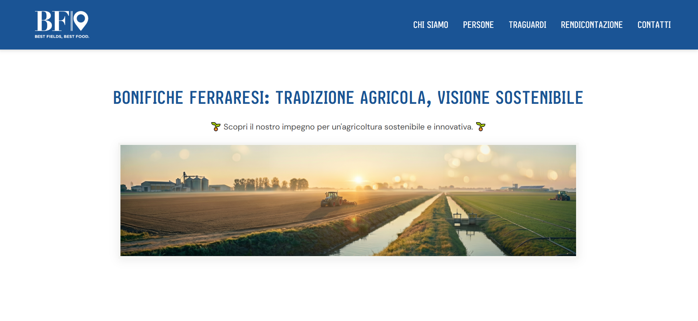
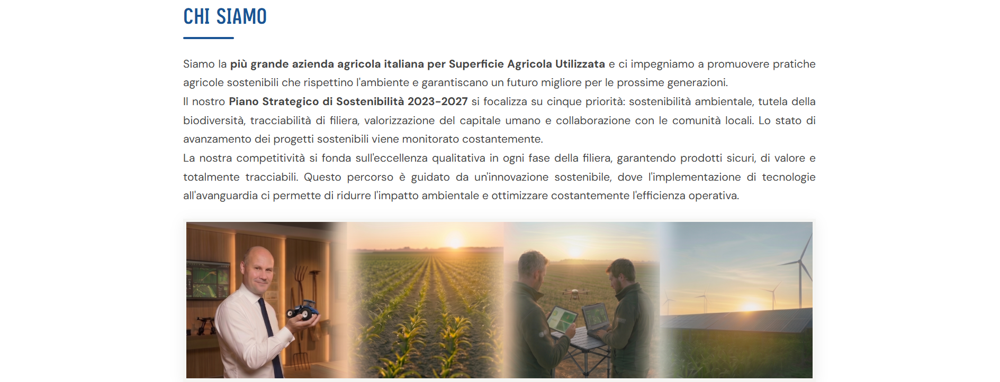
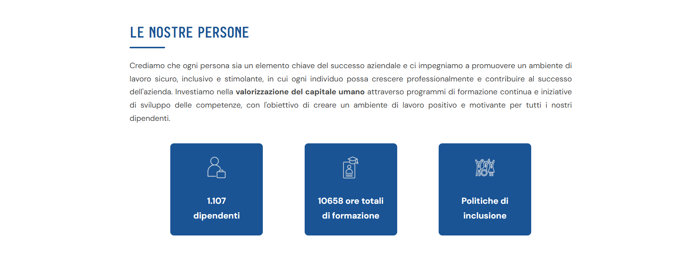
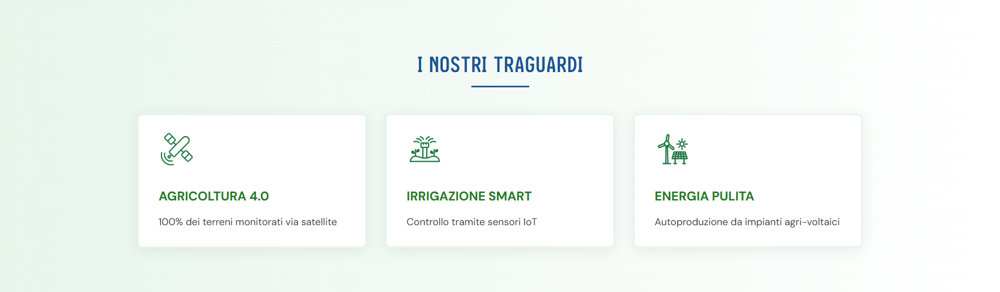
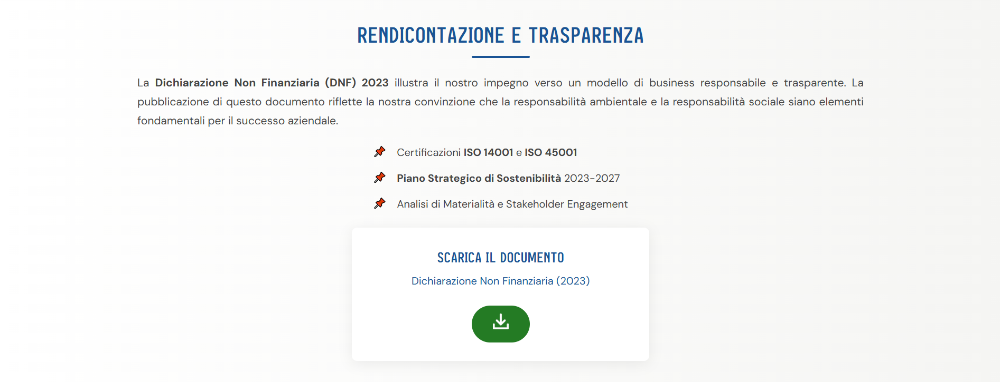

# Project Work: BF S.p.A.: esempio italiano di Innovazione Sostenibile 🌱

Tema n. **3**: Tecnologia web per la sostenibilità d’impresa

PW **17**. Sviluppo di una pagina web per il download dei report di sostenibilità di un’impresa del settore primario

---

## Descrizione
Questo repository contiene il codice sorgente della pagina web sviluppata per il Project Work del corso di laurea **Informatica per le aziende digitali (L-31)**. L'obiettivo della pagina è: 
- comunicare l'impegno dell'azienda **Bonifiche Ferraresi S.p.A.** in ambito di sostenibilità ambientale e sociale;
- consentire il download della **Dichiarazione Non Finanziaria** (2023).

---

## Anteprima della pagina web
- **Hero** - messaggio principale della pagina
  
  
  
- **Chi Siamo** - descrizione della mission aziendale e Piano Strategico 2023-2027
  
  
  
- **Le Nostre Persone** - dati sul capitale umano
  
  
  
- **I Nostri Traguardi** - KPI di sostenibilità e innovazione tecnologica

  
  
- **Rendicontazione e Trasparenza** - DNF 2023 e download del documento
  
  

- **Footer** - contatti e informazioni
  
  

---

## 🔗 Link alla pagina

---

Boga Elisa (0312301184), A.A. 2025/2026
